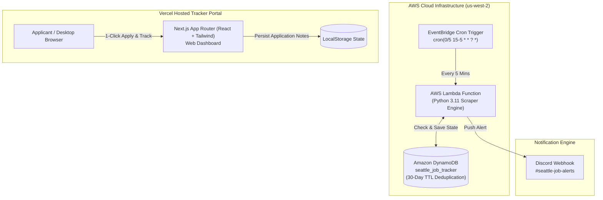

# ⚡ Instant Seattle Tech Job Monitor & Speed Tracker (SWE & PM)

An automated job monitoring and tracking platform engineered to detect and alert on new **Software Engineering (SWE/SDE)** and **Product Management (PM)** job postings across 15 target tech companies in the **Greater Seattle Area (Seattle, Bellevue, Redmond)** within 5 minutes of release.

---

## 🎯 Key Objectives & Targets

- **Target Window**: Active polling execution every 5 minutes between **8:00 AM and 10:00 PM PST daily**.
- **15 Target Tech Companies**: Stripe, Databricks, Snowflake, DoorDash, Palantir, Snap Inc., Amazon, Microsoft, Google, Apple, Meta, Uber, LinkedIn, NVIDIA, Oracle.
- **Zero/Minimal Cost**: AWS Free Tier architecture (AWS Lambda + DynamoDB pay-per-request + EventBridge).
- **Instant Application Web Portal**: Vercel-hosted Next.js web application equipped with speed analytics, direct apply links, and resume version tracking.

---

## 🏗️ System Architecture



---

## 💼 15-Company Integration Matrix

| Company | ATS / Portal Type | Endpoint / Integration Strategy | Location Filter |
| :--- | :--- | :--- | :--- |
| **Stripe** | Greenhouse | REST API (`/v1/boards/stripe/jobs`) | Seattle, Bellevue, Redmond |
| **Databricks** | Greenhouse | REST API (`/v1/boards/databricks/jobs`) | Seattle, Bellevue, Redmond |
| **Snowflake** | Greenhouse | REST API (`/v1/boards/snowflake/jobs`) | Seattle, Bellevue, Redmond |
| **DoorDash** | Greenhouse | REST API (`/v1/boards/doordash/jobs`) | Seattle, Bellevue, Redmond |
| **Palantir** | Greenhouse | REST API (`/v1/boards/palantir/jobs`) | Seattle, Bellevue, Redmond |
| **Snap Inc.** | Lever | REST API (`/v0/postings/snap?mode=json`) | Seattle, Bellevue, Redmond |
| **Amazon** | Custom API | `amazon.jobs/en/search.json` | Seattle, WA, Bellevue, WA |
| **Microsoft** | Custom API | `gcsservices.careers.microsoft.com` | Seattle, Bellevue, Redmond |
| **Google** | Custom API | Google Careers Search API (`/api/v3/search`) | Seattle, WA, Bellevue, WA |
| **Apple** | Custom API | Apple Jobs API (`/api/v1/job/search`) | Seattle, Bellevue |
| **Meta** | Custom API | Meta Careers Search API | Seattle, WA, Bellevue, WA |
| **Uber** | Workday CXS | Workday Endpoint (`uber.wd1.myworkdayjobs.com`) | Seattle, WA, Bellevue, WA |
| **LinkedIn** | Custom API | LinkedIn Careers Feed | Seattle, Bellevue, Redmond |
| **NVIDIA** | Workday CXS | Workday Endpoint (`nvidia.wd5.myworkdayjobs.com`) | Seattle, WA, Redmond, WA |
| **Oracle** | Workday CXS | Workday Endpoint (`oracle.wd1.myworkdayjobs.com`) | Seattle, WA, Bellevue, WA |

---

## 🚀 Quick Start Guide

### Prerequisites
- **Node.js**: v18.0.0 or higher
- **Python**: 3.11+
- **Terraform** (optional, for deploying AWS backend): v1.5+

### 1. Local Development (Next.js Web Portal)

1. Clone the repository and install dependencies:
   ```bash
   npm install
   ```

2. Start the Next.js development server:
   ```bash
   npm run dev
   ```

3. Open [http://localhost:3000](http://localhost:3000) in your browser.

---

### 2. Testing Python Lambda Scraper Locally

Run the Lambda handler script directly in Python to test scraper execution across all 15 company career portals:

```bash
python lambda_function.py
```

---

## 🌐 Deploying Web Portal to Vercel

1. Push your code to GitHub / GitLab / Bitbucket.
2. Go to [Vercel Dashboard](https://vercel.com/dashboard) and click **"Add New Project"**.
3. Import your `Seattle-Job-Alert-System` repository.
4. Vercel automatically detects Next.js build settings (`npm run build`).
5. Click **Deploy**.

---

## ☁️ Deploying AWS Infrastructure (Terraform)

The backend infrastructure provisions an AWS Lambda function, DynamoDB deduplication table, IAM policies, and EventBridge 5-minute cron triggers.

1. Zip the Lambda package:
   ```bash
   powershell Compress-Archive -Path lambda_function.py -DestinationPath lambda_function.zip -Force
   ```

2. Initialize and apply Terraform:
   ```bash
   terraform init
   terraform apply -var="discord_webhook_url=YOUR_DISCORD_WEBHOOK_URL"
   ```

---

## 🔔 Discord Webhook Integration Setup

1. Open your Discord server settings -> **Integrations** -> **Webhooks**.
2. Click **New Webhook**, name it `#seattle-job-alerts`, and copy the Webhook URL.
3. Supply the URL into `main.tf` or set the `DISCORD_WEBHOOK_URL` environment variable in your AWS Lambda configuration.

---

## 📂 Repository Structure

```
├── lambda_function.py     # Python AWS Lambda engine (15-company scrapers & Discord alert)
├── main.tf                # Terraform IaC (DynamoDB, IAM, Lambda, EventBridge cron)
├── src/
│   ├── app/
│   │   ├── layout.js      # Next.js Root Layout & Metadata
│   │   ├── page.js        # Instant Job Monitor & Tracker Web Portal
│   │   └── globals.css    # Dark Zinc Theme & Tailwind CSS Rules
├── package.json           # Next.js scripts & dependencies
├── postcss.config.js      # PostCSS configuration (@tailwindcss/postcss)
├── tailwind.config.js     # Tailwind CSS theme configuration
└── .gitignore             # Ignore rules for Node, Next.js, Terraform & secrets
```

---

## 🛡️ License

MIT License. Designed and built for high-speed tech job tracking in the Greater Seattle area.
